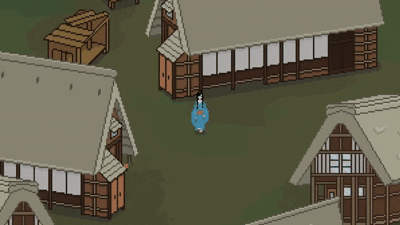

## TokYy framework

`TokYy` is an entire library used to create, train and evaluate models. It's advantages are the modularity it brings in the training process.

## Video-Games Development Passionate

### Having Blender and Unreal Engine running simultaneously hits harder than 124 mg. of Fent.

#### Blender Villain Ark
> I create my own meshes and animations. 

#### Unreal Engine Hero Ark
> Starting in UE4 and continuing in UE5, my game development journey ended in 2025. I created mostly 3D games, third-person and first-person focusing on delivering the right atmosphere.

> Below you can see some of my works.

  <figure>
    
  </figure>
  
  <figure>
    
  </figure>

